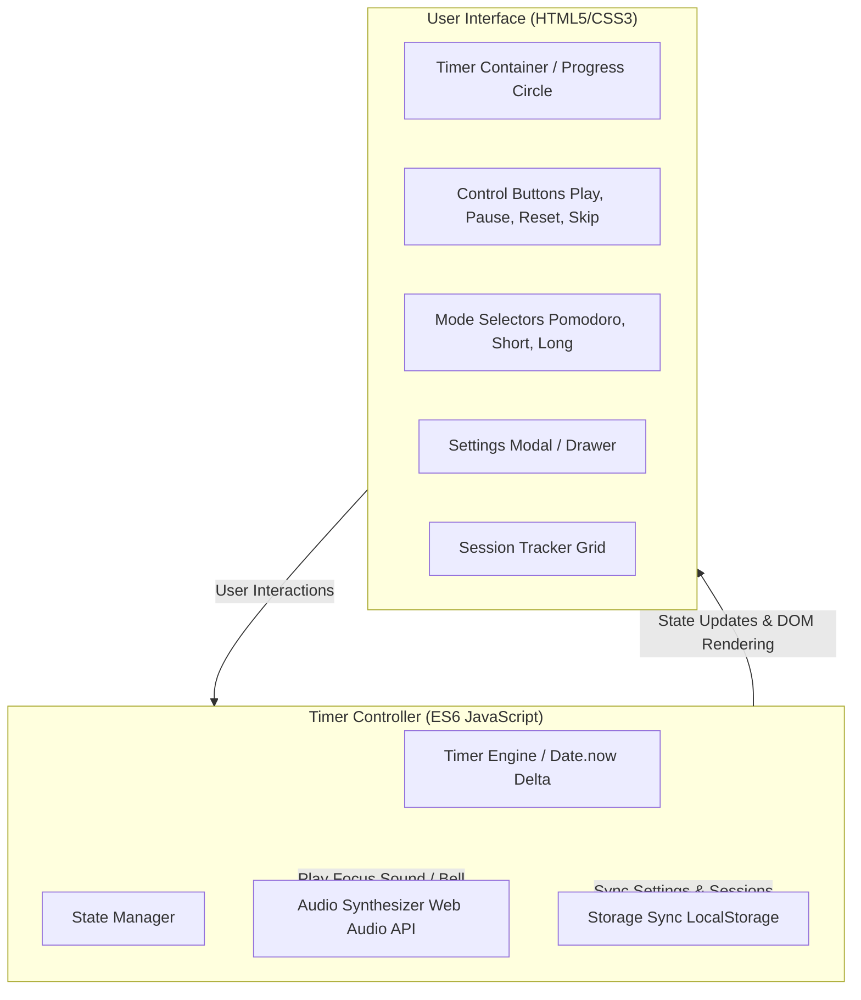

# Technical Specification: Premium Web-Based Pomodoro Timer

This document outlines the detailed system architecture, user interface design system, functional requirements, state machine logic, and verification criteria for a premium, modern, glassmorphic Pomodoro Timer web application.

---

## 1. Overview & Objectives

The goal is to build a highly polished, responsive, and distraction-free Pomodoro timer that elevates the user's focus experience. It must feel premium, fluid, and modern, implementing **dark-mode first** glassmorphism, responsive typography, custom sound synthesis, and highly accurate timing mechanism that handles browser-background throttling gracefully.

### Key Objectives:
- **Flawless Timer Accuracy**: Ensure timing does not drift or pause when the user switches tabs.
- **Premium UX/UI**: Immersive, dark-themed glassmorphism, rich interactive hover/focus states, and silky-smooth animations.
- **Self-Contained Audio**: Notification alarms synthesized via the HTML5 Web Audio API to guarantee reliable sound generation with zero external asset dependencies.
- **State Persistence**: Persist session counts, custom timer configurations, and audio settings across page reloads using browser local storage.

---

## 2. System Architecture

To ensure speed, extreme lightweight packaging, and high maintainability, the application is built on a clean, zero-dependency, single-page architecture using standard web technologies.



### File Structure:
All application assets must reside in a flat, clean structure to ensure ease of deployment:
```
/Users/laleha/Documents/Projects/agy/
├── index.html          # Semantic HTML5 markup and structure
├── style.css           # Premium vanilla CSS variables, glassmorphism, animations
├── app.js              # Application logic, accurate timers, audio synthesis, persistence
└── technical_spec.md   # This design document
```

---

## 3. Design System & UI Specifications

The interface should feel calm, organic, and ultra-modern. We employ a **glassmorphic** style placed over a deep, dark gradient background to give a premium workspace appearance.

### 3.1 Color Palette (HSL-based)
All colors are specified using HSL to allow for smooth transitions and state-based adjustments.

| Token | Description | HSL Value | Hex Equivalent |
| :--- | :--- | :--- | :--- |
| `--bg-gradient-start` | Main background start | `hsl(220, 20%, 6%)` | `#0c0e12` |
| `--bg-gradient-end` | Main background end | `hsl(220, 25%, 12%)` | `#171b24` |
| `--glass-bg` | Floating cards background | `hsla(220, 20%, 15%, 0.45)` | `#1c212b (Opacity 45%)` |
| `--glass-border` | Subtle highlighting border | `hsla(220, 20%, 100%, 0.08)`| `White (Opacity 8%)` |
| `--text-primary` | Standard readable text | `hsl(210, 20%, 95%)` | `#f1f3f5` |
| `--text-muted` | Secondary description text | `hsl(215, 12%, 65%)` | `#9ea4b0` |
| `--color-work` | Accent color for Focus state | `hsl(355, 78%, 56%)` | `#ee3f46` |
| `--color-short` | Accent color for Short Break | `hsl(150, 60%, 48%)` | `#31c47f` |
| `--color-long` | Accent color for Long Break | `hsl(200, 80%, 52%)` | `#219df3` |

### 3.2 Typography
- **Primary Font**: `Outfit` or `Inter`, falling back to standard system sans-serif (`-apple-system`, `BlinkMacSystemFont`, `Segoe UI`, etc.).
- **Typography Sizing & Weights**:
  - Timer Display: `7.5rem` to `9rem` (font-weight: `700` or `800`, tabular-nums for monospaced number columns to avoid shifting/layout-jitter on tick).
  - Main Heading: `1.8rem` (font-weight: `600`, tracking: `-0.02em`).
  - Session Labels / Controls: `1rem` (font-weight: `500`).

### 3.3 Visual & Micro-interactions
1. **The Glassmorphic Card**:
   - `backdrop-filter: blur(20px) saturate(180%);`
   - `box-shadow: 0 8px 32px 0 rgba(0, 0, 0, 0.37);`
   - Border width of `1px` with a subtle linear-gradient overlay (`--glass-border`).
2. **Interactive Progress Circle**:
   - A SVGCircle overlaying the timer.
   - It animates smoothly via CSS `stroke-dashoffset` as the countdown progress updates.
   - Transition curve: `stroke-dashoffset 1s linear` or dynamic frame updates for buttery-smooth visual progression.
3. **Control Transitions**:
   - Focus outline: Custom accent outer glow (`box-shadow: 0 0 0 3px var(--color-active-glow)`).
   - Button hover scaling: `transform: scale(1.05);` with standard cubic-bezier transition (`transition: transform 0.2s cubic-bezier(0.16, 1, 0.3, 1)`).
   - Button active (pressed) scaling: `transform: scale(0.96);`.

---

## 4. Functional Requirements

### 4.1 Timer Core Engine & Mode Control
The timer supports three distinct operational states, each with its default duration and thematic colors:
- **Work (Focus)**: 25 minutes (`--color-work`).
- **Short Break**: 5 minutes (`--color-short`).
- **Long Break**: 15 minutes (`--color-long`).

#### Tab-Inactivity Protection (Anti-Drift):
Traditional `setInterval(fn, 1000)` drifts heavily when tabs are backgrounded due to browser CPU throttling. 
- **Requirement**: The timer must calculate duration by subtracting current system time (`Date.now()`) from a calculated target time (`expectedEndTime`). This ensures that even if browser execution freezes for 2 minutes, when the tab is focused again, the clock immediately displays the mathematically correct time and alerts the user if the timer expired during inactivity.

### 4.2 Interactive Controls
- **Start / Play**: Initiates the session. Play icon morphs smoothly into Pause icon.
- **Pause**: Halts the timer, capturing the exact remaining seconds.
- **Reset**: Reverts the current mode to its full initial duration.
- **Skip**: Forwards the user directly to the next phase (e.g., skips Work to Short Break).
- **Settings Toggle**: Opens a non-intrusive modal or slide-out drawer to change settings.

### 4.3 Custom Adjustments (Settings Modal)
Users must be able to customize their sessions on-the-fly:
- **Work duration**: Input field (1 to 120 minutes).
- **Short Break duration**: Input field (1 to 60 minutes).
- **Long Break duration**: Input field (1 to 60 minutes).
- **Auto-start Breaks**: Toggle switch (if enabled, immediately starts break upon Pomodoro completion).
- **Auto-start Pomodoros**: Toggle switch (if enabled, immediately starts focus upon break completion).

### 4.4 Web Audio Sound Synthesis
Instead of bundling and risking broken links or delayed loading of audio `.mp3` files, the application will use the HTML5 **Web Audio API** to synthesize beautiful audio cues.

#### Focus Bell Synthesis Spec (Mellow Chime):
```javascript
function playFocusBell() {
    if (isMuted) return;
    const AudioContext = window.AudioContext || window.webkitAudioContext;
    const ctx = new AudioContext();
    
    // Create a beautiful complex tone (Sine wave combined with soft Triangle harmonic)
    const osc1 = ctx.createOscillator();
    const osc2 = ctx.createOscillator();
    const gainNode = ctx.createGain();
    
    osc1.connect(gainNode);
    osc2.connect(gainNode);
    gainNode.connect(ctx.destination);
    
    // Frequencies (E5 & B5 perfect fifth chime)
    osc1.type = 'sine';
    osc1.frequency.setValueAtTime(659.25, ctx.currentTime); // E5
    osc2.type = 'triangle';
    osc2.frequency.setValueAtTime(987.77, ctx.currentTime); // B5
    
    // Gain Envelope (Soft attack, long decay chime)
    gainNode.gain.setValueAtTime(0.001, ctx.currentTime);
    gainNode.gain.linearRampToValueAtTime(0.3, ctx.currentTime + 0.05);
    gainNode.gain.exponentialRampToValueAtTime(0.001, ctx.currentTime + 1.2);
    
    osc1.start();
    osc2.start();
    
    osc1.stop(ctx.currentTime + 1.5);
    osc2.stop(ctx.currentTime + 1.5);
}
```
*A separate design or volume level is to be synthesized for break completion vs focus completion.*

### 4.5 Session Tracker
- Tracks completed "Work" sessions within the current session block.
- Visual display: Elegant small checkmarks, dots, or glass progress capsules that increment upon completion.
- Stores historical stats (total pomodoros completed) inside `localStorage`.
- Includes a **Reset Stats** button to wipe completed logs.

---

## 5. App State Machine & Storage Details

### State Variables (JS Model)
```javascript
const state = {
    timerState: 'idle',      // 'idle' | 'running' | 'paused'
    currentMode: 'work',     // 'work' | 'short' | 'long'
    timeLeft: 1500,          // remaining seconds
    totalDuration: 1500,     // current mode base duration in seconds
    expectedEndTime: null,   // epoch timestamp when timer will hit 0
    sessionCount: 0,         // completed work sessions
    settings: {
        workDuration: 25,    // in minutes
        shortDuration: 5,    // in minutes
        longDuration: 15,    // in minutes
        autoStartBreaks: false,
        autoStartPomodoros: false
    },
    audioMuted: false        // sound configuration
};
```

### Persistence Logic
Upon initialized application load, JS checks for the existence of:
- `pomodoro_settings`: Overrides default durations/auto-start toggles.
- `pomodoro_sessions_total`: Increments over time.
- `pomodoro_audio_muted`: Stores sound states.

Whenever settings change, serialize the objects back to local storage.

---

## 6. Acceptance Criteria & Verification Plan

All implementations must meet these strict criteria to pass QA review.

### 6.1 Acceptance Criteria (AC)

#### AC 1: Core Layout & Responsiveness
- **AC 1.1**: The application renders perfectly without any horizontal scrollbars on viewports ranging from small smartphones ($320\text{px}$) to wide cinematic screens ($2560\text{px}$).
- **AC 1.2**: Background contains a smooth gradient. Central card uses transparent glassmorphism (`backdrop-filter`).
- **AC 1.3**: Timer numerals employ tabular-nums monospacing. The layout must not twitch, jitter, or shift even slightly when numbers update.

#### AC 2: State Flow & Navigation
- **AC 2.1**: Clicking "Start" transitions the state to running. Active progress ring updates smoothly.
- **AC 2.2**: Clicking "Pause" preserves remaining time exactly.
- **AC 2.3**: Skipping transitions immediately to the next designated phase (e.g., Work -> Short Break -> Work -> Short Break -> Work -> Long Break).
- **AC 2.4**: Dynamic tab titles update with the current countdown (e.g. `(24:12) Focus Session`).

#### AC 3: Audio Synthesis & Custom Settings
- **AC 3.1**: When timer hits `00:00`, a beautiful synthesized chime sounds. No external network request is triggered to load audio.
- **AC 3.2**: Changing durations in settings update the respective countdown state immediately (if timer is inactive). Invalid entries (e.g., negative integers or letters) are caught with error bounds and fallback values.
- **AC 3.3**: Settings are synced instantly to `localStorage`.

---

## 7. QA Verification Protocols

### Manual Verification Checklist
1. **Clock Drift Test**:
   - Start the timer. Switch browser tabs.
   - Keep tab out of focus for 60 seconds.
   - Return to the timer tab. Check with external stopwatch. Verify drift is $< 100\text{ms}$.
2. **Audio Volume Test**:
   - Click sound preview button. Ensure pleasant synthesizer acoustics are output.
   - Toggle Mute. Ensure synthesized audio node is not started or gain is absolute zero.
3. **Session Auto-Transition Test**:
   - Turn on "Auto-start Breaks".
   - Set Pomodoro duration to `1` second (using temporary dev settings or direct state edits).
   - Let timer run out. Verify state switches immediately to "Short Break" and the timer begins counting down without any user manual interaction.

---

*Prepared and Approved by Product Manager (@pm)*
*Target Workspace Location*: `/Users/laleha/Documents/Projects/agy/`
