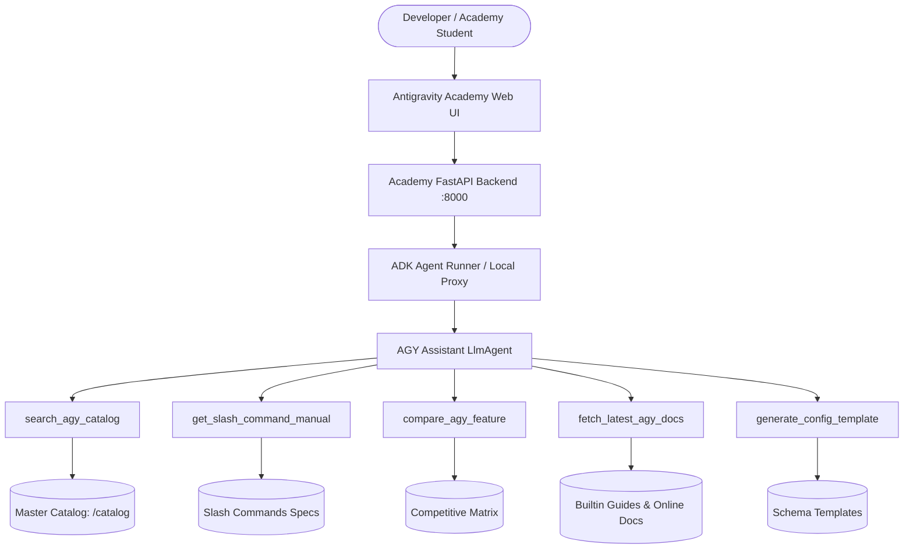

# Technical Specification: Antigravity (AGY) Academy AI Assistant Agent

**Application Name**: `agy-agent`  
**Root Directory**: `/Users/laleha/Documents/Projects/agy/agy-agent`  
**Author**: @pm (Product Manager Persona)  
**Target Audience**: Developers, Students, and Engineers using the Antigravity Academy platform  
**Status**: Approved Specification  

---

## 1. Executive Summary & Core Objective

The **Antigravity Academy AI Assistant Agent** (`agy-agent`) is an ADK-powered conversational agent designed to provide deep, up-to-date knowledge about Google Antigravity (AGY) features, architectures, slash commands, rules, customizations, and workflows.

The agent is inspired by and grounded in the **Antigravity Master Catalog** (`antigravity_academy/catalog/`), official reference documentation (`antigravity-guide`, `agy-customizations`), and live online documentation. It is directly exposed as an interactive AI companion inside the **Antigravity Academy** web interface (`http://localhost:8000`) and also runs standalone via the standard ADK runtime, CLI (`agents-cli run`, `agents-cli playground`), and A2A protocol.

---

## 2. User Stories & Core Features

### User Stories
1. **As an Antigravity Academy learner**, I want to chat with an AI assistant inside the Academy web UI to ask questions about AGY features (e.g. how `/goal` works vs `/plan`, how to structure `.agents/AGENTS.md`, or how to build custom skills).
2. **As an engineer migrating from Cursor or Claude Code**, I want to query the competitive feature parity matrix to understand AGY's unique advantages (e.g., subagent hierarchies, terminal sandboxes, persistent background tasks, sidecars).
3. **As a developer configuring an agent workspace**, I want the agent to generate copy-paste ready config templates (`AGENTS.md`, `GEMINI.md`, `SKILL.md`, `mcp.json`) tailored to my needs.
4. **As an enterprise architect**, I want to retrieve the latest documentation and release notes from official AGY sources.

### Core Features
- **Semantic & Structured Catalog Search**: Fast keyword and structured search over the Master Catalog (`slash_commands.md`, `competitive/feature_parity_matrix.md`, `slash/plan_vs_goal.md`, rules, and guides).
- **Slash Commands Knowledge Engine**: Authoritative manual for all 25 Antigravity slash commands, parameter syntax, and combo recipes.
- **Competitive Intelligence**: Matrix comparisons across Cursor, Claude Code, Windsurf, Copilot, and Devin.
- **Config & Blueprint Generator**: Generation of compliant configurations with automated schema verification.
- **Latest Docs Retrieval**: Ability to fetch live updates, documentation guides, and changelogs.
- **Interactive Academy Integration**: REST API endpoints (`/api/chat`, `/api/chat/history`) and a modern chat UI tab/drawer integrated into the Antigravity Academy frontend.
- **Robust Local & Cloud Execution**: Seamless switching between Vertex AI, Google GenAI API keys, and local offline fallback mode for zero-configuration testing.

---

## 3. System Architecture & Components



### Module Layout
```
agy-agent/
├── app/
│   ├── __init__.py               # ADK App declaration
│   ├── agent.py                  # Root agent definition & LLM instructions
│   ├── tools.py                  # ADK Tool functions (catalog, commands, compare, docs, templates)
│   ├── knowledge.py              # Knowledge base indexer & local document retriever
│   ├── fast_api_app.py           # Standalone ADK FastAPI & A2A server
│   └── app_utils/                # Scaffolding utilities (A2A, telemetry, services)
├── tests/
│   ├── unit/                     # Unit test suites (tools, knowledge, prompt generation)
│   ├── integration/              # Integration tests (API chat, runner execution)
│   └── eval/                     # ADK evaluation dataset & criteria
├── pyproject.toml                # Project dependencies and tool configurations
├── technical_spec.md             # This document
└── README.md                     # Documentation and quickstart instructions
```

---

## 4. Tool Specifications

### 1. `search_agy_catalog`
- **Signature**: `search_agy_catalog(query: str, category: str = "all") -> str`
- **Description**: Searches the Antigravity Master Catalog for information regarding slash commands, competitive matrices, workflows, rules, and best practices.
- **Categories**: `"all"`, `"slash"`, `"competitive"`, `"workflows"`, `"rules"`.

### 2. `get_slash_command_manual`
- **Signature**: `get_slash_command_manual(command_name: str) -> str`
- **Description**: Returns detailed specifications, syntax, options, and recommended recipes for a specific slash command (e.g. `/plan`, `/goal`, `/grill-me`, `/schedule`, `/learn`).

### 3. `compare_agy_feature`
- **Signature**: `compare_agy_feature(feature_area: str, competitor: str = "all") -> str`
- **Description**: Compares Antigravity with external platforms (Cursor, Claude Code, Windsurf, GitHub Copilot, Devin) on a given topic (e.g., subagents, terminal sandbox, browser automation, multi-agent teams).

### 4. `fetch_latest_agy_docs`
- **Signature**: `fetch_latest_agy_docs(topic: str) -> str`
- **Description**: Retrieves the most up-to-date documentation on Antigravity concepts (e.g. `skills`, `rules`, `hooks`, `plugins`, `sidecars`, `mcp`, `sandbox`, `permissions`, `changelog`).

### 5. `generate_config_template`
- **Signature**: `generate_config_template(config_type: str, details: str = "") -> str`
- **Description**: Generates syntactically correct and validated templates for `.agents/AGENTS.md`, `GEMINI.md`, `SKILL.md`, or `mcp.json`.

---

## 5. Academy Website Integration Plan

1. **Backend Integration (`antigravity_academy/app/routers/api.py`)**:
   - Add a `/api/assistant/chat` endpoint accepting `{ "message": str, "session_id": Optional[str] }`.
   - Forward calls to the AGY Agent instance (with streaming or direct response).
   - Maintain conversation history in memory for multi-turn dialogue.

2. **Frontend Integration (`antigravity_academy/app/templates/index.html` & `static/app.js`)**:
   - Add a dedicated navigation tab **"AI Assistant"** (or floating quick-access modal).
   - Provide suggested prompt pills (e.g., *"How does /goal differ from /plan?"*, *"Compare AGY with Cursor"*, *"Generate @pm and @coder rules"*, *"How to build custom skills?"*).
   - Render responses with formatted Markdown, code syntax highlighting, and copy buttons.

---

## 6. Workspace & Quality Compliance Checklist

- **Environment Isolation**: `.venv` must exist in `agy-agent/`. All commands executed via `source .venv/bin/activate && ...`.
- **Strict Typing**: Typed Python 3.11+ for all agent and tool logic.
- **Formatting**: `black` formatting applied before task completion.
- **Testing**: Complete unit and integration test coverage in `tests/`.
- **No Unrequested Features**: Implementation strictly adheres to this specification.

---

## 7. Approval & Hand-off

Drafted by: **@pm**  
Target for implementation: **@coder**  
Target for quality verification: **@qa**  
Status: **Ready for Implementation**
