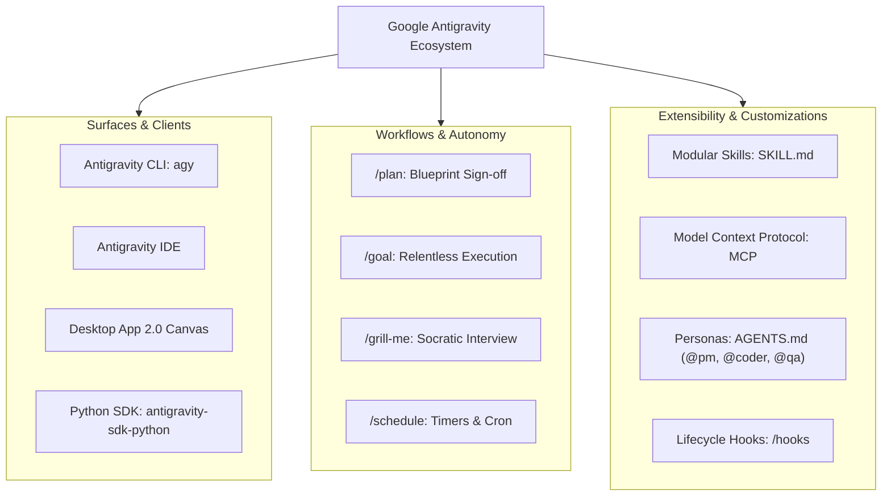

# Google Antigravity (AGY) Master Catalog

Welcome to the **Antigravity Master Catalog**. This catalog serves as the central reference repository for Google Antigravity architectures, commands, competitive intelligence, rules, workflows, and developer tools.

## Catalog Modules

| Module | Primary Reference | Formats Available | Description |
| :--- | :--- | :---: | :--- |
| **Competitive Intelligence** | **[feature_parity_matrix.md](competitive/feature_parity_matrix.md)** | Markdown Tables, JSON | Executive feature parity scorecard comparing AGY against Cursor, Claude Code, Windsurf, Copilot, and Devin. |
| **Slash Commands** | **[slash_commands.md](slash/slash_commands.md)** | Markdown Guide, JSON Schema | Comprehensive manual for all 25 Antigravity slash commands with examples and combo recipes. |
| **Workflow Deep Dives** | **[plan_vs_goal.md](slash/plan_vs_goal.md)** | Markdown, Mermaid Diagrams | Comparison of `/plan` (architectural sign-off) vs `/goal` (autonomous test-healing loops). |
| **Rules & Teams** | **[Rules Catalog](rules/)** | Markdown, Templates | Configuration standards for `.agents/AGENTS.md` (@pm, @coder, @qa) and `GEMINI.md`. |

---

## Ecosystem Architecture

