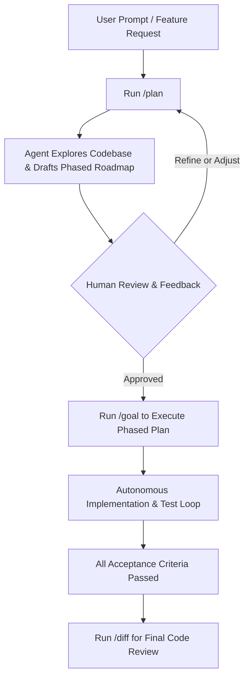

# Deep Dive: `/plan` vs `/goal`

In **Google Antigravity (AGY)**, both [`/plan`](slash_commands.md#2-plan) and [`/goal`](slash_commands.md#1-goal) are core workflow slash commands designed to tackle non-trivial engineering tasks. However, they serve fundamentally different phases of the software development lifecycle.

---

## 1. Quick Comparison Matrix

| Dimension | [`/plan`](slash_commands.md#2-plan) | [`/goal`](slash_commands.md#1-goal) |
| :--- | :--- | :--- |
| **Primary Intent** | **Architectural design & roadmap** | **Autonomous execution & verification** |
| **Execution Phase** | Pre-execution (thinking before doing) | Active implementation (doing & verifying) |
| **Agent Behavior** | Analyzes the codebase, identifies risks, and breaks the task into phased milestones | Relentlessly writes code, runs terminal commands, executes tests, and fixes failures |
| **Human Interaction** | **High gatekeeping**: Pauses to present a plan for user review, discussion, and sign-off | **Hands-off autonomy**: Operates independently without stopping until acceptance criteria pass |
| **Stopping Condition** | Stops once a structured, verified plan is generated | Stops only when the objective is 100% met and verified |
| **Primary Output** | An actionable implementation specification or roadmap | Completed code changes, passing test suites, and working features |
| **Risk Profile** | Low (read-only research & specification) | High (modifies files, executes builds, runs tests) |

---

## 2. When to Use [`/plan`](slash_commands.md#2-plan)

Use `/plan` when **the path forward is uncertain, high-risk, or requires human alignment** before any files are modified.

### Key Characteristics
- **Non-destructive**: Does not jump straight into changing codebase files.
- **Dependency & Risk Analysis**: Examines imported packages, potential breaking changes, database schemas, and API contracts.
- **Milestone Breakdown**: Structures the task into logical phases (e.g., Phase 1: Models, Phase 2: Services, Phase 3: Tests).
- **Human Review Gate**: Presents a plan artifact for user feedback, adjustments, and explicit approval before any execution begins.

### Ideal Scenarios
- Designing major architectural refactors.
- Adding multi-tier features touching database migrations, backend endpoints, and frontend state.
- Working in production or shared team codebases where changes must be strictly audited.

### Example Invocation
```text
/plan Migrate the authentication module from SQLite session tokens to PostgreSQL with JWT and refresh token rotation.
```

---

## 3. When to Use [`/goal`](slash_commands.md#1-goal)

Use `/goal` when **the target acceptance criteria are known, and the agent needs relentless persistence to achieve them**.

### Key Characteristics
- **Full Autonomy**: The agent is authorized to iterate through code edits, command runs, and error fixes without stopping to ask trivial questions.
- **Relentless Verification Loop**: The agent will:
  1. Write or update implementation files.
  2. Execute verification commands (e.g. `pytest`, `npm test`, compiler checks).
  3. Inspect tracebacks or test failures.
  4. Automatically refine and patch the code.
  5. Repeat until 100% of acceptance criteria pass.
- **Overnight & Background Friendly**: Ideal for tasks left running while you step away.

### Ideal Scenarios
- Writing end-to-end or unit test suites targeting 100% code and branch coverage.
- Porting 20+ endpoints from a legacy framework to a modern framework.
- Fixing all linting errors, typing issues, and compiler warnings across an entire project.

### Example Invocation
```text
/goal Write unit tests for all routers in app/routers/ until branch coverage reaches 100% and black formatting passes with zero errors.
```

---

## 4. The Recommended Pattern: "Plan-then-Goal"

The most effective workflow combines both commands sequentially:



### Step-by-Step Walkthrough

1. **Phase 1: Blueprint with `/plan`**
   ```text
   /plan Add rate limiting and caching to all public API endpoints using Redis.
   ```
   *Outcome*: The agent inspects existing middleware, proposes a Redis client wrapper, defines rate limit quotas, and creates a plan artifact.

2. **Phase 2: Review and Sign-off**
   You review the plan artifact, tweak any caching expiration windows, and give approval.

3. **Phase 3: Autonomous Build with `/goal`**
   ```text
   /goal Execute the approved Redis rate limiting plan, run unit tests, and verify endpoints return HTTP 429 when limits are exceeded.
   ```
   *Outcome*: The agent provisions the environment, creates Redis middleware, writes tests, runs `pytest`, and confirms all tests pass.

4. **Phase 4: Final Inspection with `/diff`**
   ```text
   /diff
   ```
   *Outcome*: You review the clean, verified code diff before committing.
