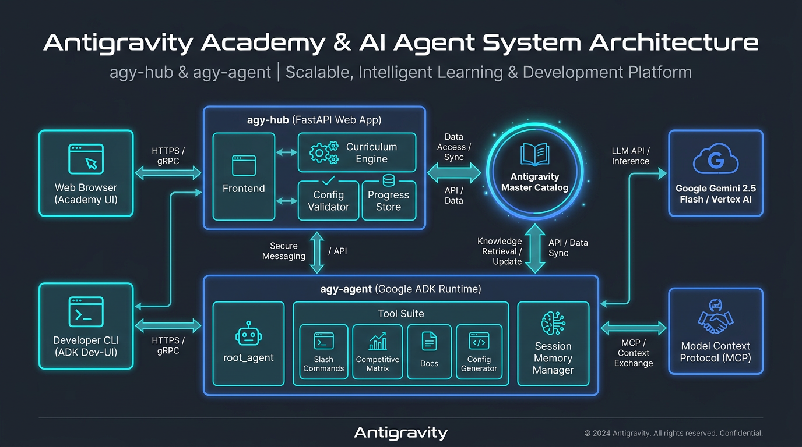
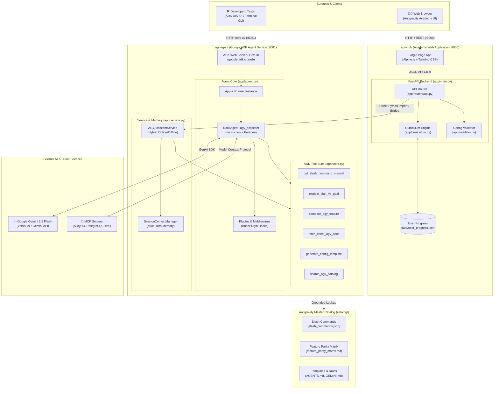

# Antigravity Academy Architecture: agy-hub & agy-agent

## High-Level System Architecture

---

## Component Breakdown

### 1. `agy-hub` (Frontend & Academy Platform)
- **Role**: Interactive browser-based training portal for Google Antigravity.
- **Components**:
  - **Single Page Interface**: Alpine.js + Tailwind UI featuring 5 tabs (Curriculum, Config Generator, Real-time Validator, Interactive Cheatsheet, AI Assistant).
  - **Curriculum Engine**: 7 structured learning modules with interactive coding tasks and progress tracking.
  - **Syntax & Schema Validator**: Validates `.agents/AGENTS.md`, `GEMINI.md`, `SKILL.md`, and `mcp.json`.
  - **Direct Assistant Bridge**: Connects `/api/assistant/chat` directly to `AGYAssistantService` with session history.

### 2. `agy-agent` (Google ADK Autonomous Agent)
- **Role**: Grounded conversational AI assistant built on Google Agent Development Kit (ADK) v2.
- **Components**:
  - **`app/agent.py`**: Configures the `root_agent` with instructions, retry options, and tools.
  - **`app/tools.py`**: 6 specialized tools that query the Antigravity Master Catalog.
  - **`app/service.py`**: High-level service providing `SessionContextManager` and dual online/offline fallback engine.
  - **`app/knowledge.py`**: Deterministic catalog resolution across local workspace and container mounts.

### 3. Shared Catalog (`catalog/`)
- Single source of truth for:
  - 25 Antigravity slash commands.
  - Architectural comparisons (`/plan` vs `/goal`).
  - Competitive matrix (Cursor, Claude Code, Windsurf, Copilot, Devin).
  - Multi-agent blueprints and security policies.
