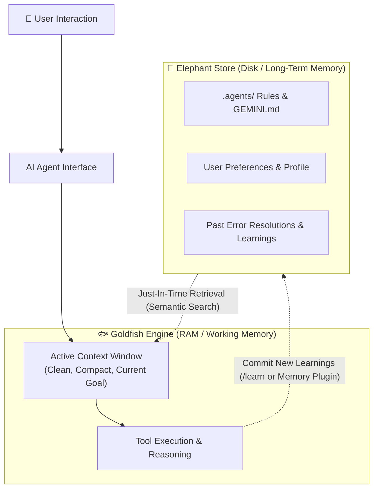

# The "Goldfish & Elephant" Memory Pattern in AI Agents

## Executive Summary

> **"Why do AI assistants forget project decisions after 20 messages, or hallucinate when context gets too long?"**
>
> Standard LLM agents operate like a **Goldfish**: brilliant within a tiny immediate window, but completely stateless across sessions. The **Goldfish & Elephant Pattern** combines razor-sharp ephemeral execution (Goldfish) with durable, persistent knowledge retention (Elephant).

---

## 1. The Core Metaphor

| Attribute | 🐟 The Goldfish (Working Memory) | 🐘 The Elephant (Persistent Memory) |
| :--- | :--- | :--- |
| **Analogy** | Computer RAM / Scratchpad | Hard Drive / Database |
| **Lifespan** | Ephemeral (Current turn or session) | Permanent (Cross-session, across weeks) |
| **Cost & Speed** | Extremely fast, high attention, low token count | Requires indexing/retrieval lookup |
| **Storage Mechanism**| Active Context Window (Prompt Tokens) | Vector DB, SQLite, `.agents/` Rules, Memory Bank |
| **Risk / Failure Mode**| "Lost in the Middle", Context Window Overflow | Outdated facts if not pruned or updated |
| **Primary Goal** | High-precision reasoning on the immediate task | Compounding learning, personalization, rule adherence |

---

## 2. The Architectural Problem

1. **Context Bloat & Token Degradation**: Stuffing 50 turns of conversation into an LLM prompt degrades attention quality ("Lost in the Middle" syndrome) and balloons API costs.
2. **Stateless Amnesia**: Starting a new session wipes out architectural agreements, user coding preferences, and previously fixed bugs.
3. **The Hybrid Solution**:
   - Keep the **Goldfish** session lean and focused: wipe transient chit-chat, tool outputs, and scratchpads.
   - Let the **Elephant** store structured facts, user preferences, and project blueprints.
   - Inject *only relevant Elephant memories* just-in-time when the Goldfish needs them.

---

## 3. How Antigravity Implements the Pattern

Google Antigravity natively implements the Goldfish & Elephant pattern through its customization layers:

1. **The Elephant Layer (Persistent Grounding)**:
   - [`.agents/AGENTS.md`](file:///.agents/AGENTS.md): Defines persistent personas (`@pm`, `@coder`, `@qa`).
   - [`.agents/GEMINI.md`](file:///.agents/GEMINI.md): Enforces non-negotiable workspace security and style guardrails.
   - Custom Skills (`SKILL.md`): Modular capabilities loaded dynamically.
   - `/learn` command: Commits newly resolved bugs or user preferences to persistent memory.

2. **The Goldfish Layer (Clean Task Execution)**:
   - `/compact` command: Prunes bloated conversation history, keeping only active goals and key state.
   - Subagent isolation: Spawning subagents (`invoke_subagent`) gives each worker a clean Goldfish context with zero baggage.

---

## 4. 2-Minute Customer Presentation Script

### Slide 1: The Problem (Hook)
> *"Every enterprise building with AI hits the same wall: AI assistants either forget what you told them yesterday, or the conversation gets so long that the model gets confused and costs 10x more per message."*

### Slide 2: The Metaphor
> *"We solve this with the **Goldfish & Elephant Pattern**. The agent thinks with the speed and sharp focus of a Goldfish—running each task in a fresh, uncluttered workspace. But behind it sits an Elephant that never forgets—persisting enterprise standards, security policies, and team preferences across sessions."*

### Slide 3: The Live Contrast (The Demo)
> *"Watch what happens when we start a brand-new session. A standard Goldfish agent has amnesia and guesses wrong. Our Elephant-backed agent immediately recalls the exact database engine and team standards agreed upon last week."*

---

## 5. Summary Checklist for Architecture Reviews

- [x] Does the agent start tasks with a clean, scoped context window?
- [x] Are persistent rules stored outside prompt payloads (e.g., in `.agents/` or vector memory)?
- [x] Is there an explicit mechanism to commit newly learned lessons back to long-term memory?
- [x] Can sessions be compacted or reset without losing persistent knowledge?
