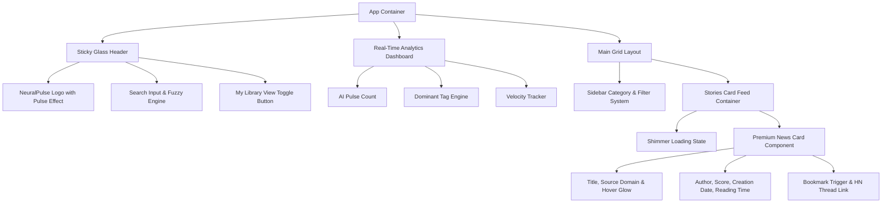
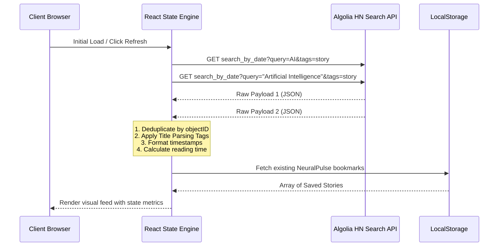

# TECHNICAL SPECIFICATION: NEURALPULSE
## Real-Time AI Intelligence Hub

---

## 1. Executive Summary & App Concept

### 1.1 Overview
**NeuralPulse** is a premium, state-of-the-art, dark-mode-first web application designed to deliver real-time AI news, developments, and discussions. It functions as a specialized intelligence layer over the public **HackerNews Algolia Search API**, filtering, classifying, and enriching stories related to Artificial Intelligence, Machine Learning, Large Language Models, and Robotics. 

### 1.2 Target Audience
Developers, AI researchers, product managers, venture capitalists, and tech enthusiasts who need a curated, highly polished, zero-noise dashboard containing the latest and most relevant AI breakthroughs.

### 1.3 Key Value Propositions
*   **Key-less, Real-time Aggregation**: Zero setup or credentials required; powered by immediate Algolia indexing.
*   **Immersive Premium Aesthetics**: A luxurious, glassmorphic visual style combining deep space blacks, neon cyans, and cosmic purples with micro-animations.
*   **Smart Categorization**: Title-parsing classification engine that instantly maps stories into intuitive category tags (e.g., GenAI, LLMs, Hardware, Safety).
*   **Personalized Workstation**: Offline-first bookmarks, customizable search syntax, reading-time estimation, and rich analytics widgets.

---

## 2. Visual & Identity System (UI/UX)

The user interface of NeuralPulse is inspired by modern developer terminals and premium SaaS platforms (such as Linear, Vercel, and Stripe). It features high-contrast readability, deep glassmorphism overlays, and fluid, high-frame-rate transitions.

### 2.1 Design Tokens & Palette

```
  Primary Dark (Canvas)      : #030712 (Tailwind Gray-950)
  Surface Dark (Card Base)   : #0B0F19 (Dark Blue-Gray)
  Card Border / Glow         : rgba(255, 255, 255, 0.06) / #8B5CF6 (Violet Glow)
  Accent Neon Cyan           : #06B6D4 (Tailwind Cyan-500)
  Accent Cosmic Purple       : #8B5CF6 (Tailwind Violet-500)
  Success Glow               : #10B981 (Tailwind Emerald-500)
  Muted Gray (Text Body)     : #9CA3AF (Tailwind Gray-400)
  Bright Gray (Text Heading) : #F3F4F6 (Tailwind Gray-100)
```

#### Gradients
*   **Primary Brand Gradient**: `linear-gradient(135deg, #06B6D4 0%, #8B5CF6 100%)`
*   **Glass Card Gradient**: `linear-gradient(180deg, rgba(16, 24, 48, 0.8) 0%, rgba(8, 12, 24, 0.95) 100%)`
*   **Glow Overlay**: Radial gradient behind elements `radial-gradient(circle, rgba(139, 92, 246, 0.15) 0%, transparent 70%)`

### 2.2 Typography
To maintain a high-end editorial and technical feel, NeuralPulse utilizes a dual-font scale:
*   **Headings**: **Outfit** (sans-serif) - Geometric, clean curves, tight kerning (`letter-spacing: -0.02em`). Used for the main brand mark, titles, and major card headers.
*   **Body & Metadata**: **Inter** (sans-serif) - Maximum readability, optimized for text-dense layouts.
*   **Monospace Elements**: **JetBrains Mono** or **Fira Code** - For reading-time meters, scores, dates, and domain tags.

### 2.3 Micro-Animations & Motion Design
Motion is utilized to denote depth, hierarchy, and interactivity. All animations are calculated at 60fps utilizing **Framer Motion** or hardware-accelerated CSS.

*   **Page Entrance Orchestration**: 
    *   Main layout utilizes a staggered spring transition: `stiffness: 120, damping: 20`.
    *   Dashboard analytics fade in first, followed by a staggered cascade of story cards.
*   **Hover Behaviors (The Glass-Tilt Effect)**:
    *   Hovering over a news card scales the element up slightly (`scale: 1.015`), raises the shadow depth, increases the opacity of its cyan/purple border gradient, and triggers a subtle inner radial glow that tracks with the cursor.
*   **Pulse & Shimmer Loaders**:
    *   Skeleton loaders do not use standard gray flashes. They use an angled translucent silver-cyan gradient moving horizontally across a `#0B0F19` backdrop at a rate of 1.5 seconds per loop (`transition: { repeat: Infinity, duration: 1.5, ease: "linear" }`).
*   **Bookmark Action Interaction**:
    *   Clicking the bookmark icon triggers a burst particle effect (4 micro-circles in cyan and purple scaling out and fading) and converts the bookmark icon from an outline to a glowing violet filled star.

---

## 3. Core Functional Features

```
┌────────────────────────────────────────────────────────────────────────┐
│                              NEURALPULSE                               │
├────────────────────────────────────────────────────────────────────────┤
│ 📊 ANALYTICS:  Total Today: [ 84 ]  |  Top Tech: [ GPT-4o ]  | Hotness: 🔥  │
├──────────────────────┬─────────────────────────────────────────────────┤
│                      │ 🔍 [ Search AI topics...        ] [ Sort: Date ▾]│
│  📂 CATEGORIES       ├─────────────────────────────────────────────────┤
│  [x] All Stories     │ 📝 Claude 3.5 Sonnet Outperforms GPT-4o         │
│  [ ] Generative AI   │    🏷️ LLMs  🕒 3 min read  💬 182 pts  👤 tech_guru │
│  [ ] LLMs            ├─────────────────────────────────────────────────┤
│  [ ] Robotics        │ 📝 NVIDIA Unveils Blackwell Architecture B200   │
│  [ ] AI Safety       │    🏷️ Hardware  🕒 5 min read  💬 341 pts  👤 hw_eng │
│  [ ] Chipsets        ├─────────────────────────────────────────────────┤
│                      │ 📝 OpenAI Establishes Safety and Security Board │
│  ⭐️ BOOKMARKS (3)     │    🏷️ Safety  🕒 2 min read  💬 95 pts  👤 safety_x │
└──────────────────────┴─────────────────────────────────────────────────┘
```

### 3.1 Live AI Stream (The Core Engine)
Retrieves the most recent stories, articles, and posts featuring Artificial Intelligence.
*   **API Ingestion**: Pulls from the Algolia HackerNews `search_by_date` endpoint.
*   **Time Filtering**: Standardizes the incoming feed to focus strictly on "today" (defined dynamically as the current UTC day starting at 00:00). If the quantity of articles published during the current calendar day is lower than 15, the ingestion engine backfills with articles from the last 48 hours to maintain a rich feed.
*   **Deduplication**: Merges multi-query outcomes (searching for both "AI" and "Artificial Intelligence") by filtering out duplicate `objectID` values before writing to the application state.

### 3.2 Dynamic Client-Side Semantic Tagging
The application automatically tags each article based on title-string analysis, adding granular context metadata tags that don't exist on standard HackerNews.

| Category Tag | Visual Styling (Border, Text, Glow) | Keywords Matches (Case Insensitive) |
| :--- | :--- | :--- |
| **LLMs & NLP** | Violet tag: `#8B5CF6` | `gpt`, `claude`, `llama`, `gemini`, `transformer`, `llm`, `language model`, `mistral`, `cohere` |
| **Generative AI** | Pink tag: `#EC4899` | `diffusion`, `midjourney`, `sora`, `stable diffusion`, `generative`, `dall-e`, `text-to-video`, `audio-gen` |
| **Hardware & Infra** | Orange tag: `#F97316` | `nvidia`, `h100`, `b200`, `tpu`, `gpu`, `chip`, `semiconductor`, `tsmc`, `hardware`, `cuda` |
| **AI Safety & Ethics** | Red/Crimson tag: `#EF4444` | `safety`, `ethics`, `alignment`, `superalignment`, `bias`, `regulate`, `copyright`, `eu ai act`, `lawsuit` |
| **Robotics & Agents** | Emerald tag: `#10B981` | `robot`, `agent`, `autonomous`, `figure 01`, `humanoid`, `drone`, `self-driving`, `tesla fsd` |
| **General AI** | Cyan tag: `#06B6D4` | *Fallback tag for any title matching "AI" or "Artificial Intelligence" outside specific keywords* |

### 3.3 Advanced Filtering & Search Hub
*   **Instant Query Filters**: Text input searches dynamically across story titles, authors, and source domains. It uses fuzzy matching to tolerate typos.
*   **Category Faceting**: A multi-select visual sidebar displaying the custom categories (with counts). Selecting one or more categories instantly updates the feed with fluid grid reorganization animations.
*   **Advanced Sorters**:
    *   *Recency (Default)*: Strictly sorted by UNIX timestamp descend.
    *   *Hotness/Popularity*: Sorted by points (`points * (comments + 1) / (hours_elapsed + 2)^1.8` - custom popularity metric).
    *   *Discussion Weight*: Sorted by number of HackerNews comments.

### 3.4 Interactive Personal Library (Bookmarking)
Allows users to save articles for asynchronous reading.
*   **Persistence**: Handled completely in local storage (`localStorage`) under the namespace key `neuralpulse_bookmarks_v1`.
*   **Interactions**:
    *   Single-tap to bookmark from the main stream.
    *   A dedicated "My Library" tab displays only saved posts.
    *   Offline Availability: Bookmark models cache complete JSON data, meaning users can view title, metadata, tag, and comments count even when disconnected from the internet.
    *   Export library: Single click to copy JSON representation of saved stories to the clipboard or export to a `.json` file.

### 3.5 Reading Time Estimator
Estimates reading time dynamically:
*   Formula: `Math.max(1, Math.ceil((titleWordCount + metadataCount) / 180))` — provides a quick estimation. If the API provides external text snippets, standard speed calculation of 200 words per minute is applied.

### 3.6 Real-Time Analytics Dashboard
Positioned at the top of the interface, this sleek glassmorphic widget displays three metrics:
1.  **AI Pulse Count**: Total unique AI stories discovered today.
2.  **Dominant Vector**: Displays the most heavily represented Category Tag in the current feed.
3.  **Velocity Metric**: The average frequency of new posts (e.g., "1 post every 18 mins").

---

## 4. Technical Architecture & Data Flows

### 4.1 Component Tree Architecture
The application is structured as a client-side Single Page Application (React/Next.js).



### 4.2 State Management Specification
We will use a native, lightweight client-side React State system supplemented by React Context to prevent prop drilling.

#### `NeuralPulseContext` State Model:
```typescript
interface Story {
  id: string;                 // Derived from Algolia objectID
  title: string;
  url: string | null;         // Direct article URL
  hnUrl: string;              // Link to the HackerNews thread
  author: string;
  points: number;
  commentsCount: number;
  timestamp: number;          // Creation time in seconds
  createdDateString: string;  // Formatted date
  category: string;           // Derived client-side
  readingTime: number;        // Derived client-side
  domain: string;             // Parsed from url
}

interface AppState {
  stories: Story[];           // Master list of merged and deduplicated stories
  filteredStories: Story[];   // Post-search and post-category subset
  bookmarks: Story[];         // Saved stories from LocalStorage
  selectedCategories: string[]; // Active filter tags
  searchQuery: string;        // Active fuzzy search input
  sortMode: 'recency' | 'popularity' | 'discussion';
  isLoading: boolean;
  error: string | null;
}
```

### 4.3 API Integration Details
To guarantee high performance and bypass the need for authenticated developer accounts, NeuralPulse communicates directly with the Algolia Search API.

#### Fetching Stories Engine
To guarantee capturing all relative entries, we make two parallel, key-less asynchronous GET requests:

1.  **Query 1 (AI Keywords)**:
    *   **Endpoint**: `https://hn.algolia.com/api/v1/search_by_date`
    *   **Parameters**:
        *   `query`: `AI`
        *   `tags`: `story`
        *   `numericFilters`: `created_at_i > [TIMESTAMP_OF_48_HOURS_AGO]`
        *   `hitsPerPage`: `50`

2.  **Query 2 (Artificial Intelligence Keywords)**:
    *   **Endpoint**: `https://hn.algolia.com/api/v1/search_by_date`
    *   **Parameters**:
        *   `query`: `"Artificial Intelligence"`
        *   `tags`: `story`
        *   `numericFilters`: `created_at_i > [TIMESTAMP_OF_48_HOURS_AGO]`
        *   `hitsPerPage`: `50`



#### Mapping & Transformation Handler
Each raw item from Algolia's payload is structured as:
```json
{
  "created_at": "2026-06-22T14:10:00Z",
  "title": "NVIDIA Blackwell GPUs Enter Full Production",
  "url": "https://nvidia.com/news/blackwell-production",
  "author": "semiconductor_pro",
  "points": 142,
  "story_text": null,
  "comment_text": null,
  "num_comments": 48,
  "story_id": null,
  "story_title": null,
  "story_url": null,
  "parent_id": null,
  "created_at_i": 1782137400,
  "objectID": "49201948"
}
```

**Transformation Function (Javascript)**:
```javascript
function transformRawStory(hit) {
  const domain = hit.url ? new URL(hit.url).hostname.replace('www.', '') : 'news.ycombinator.com';
  const category = assignCategory(hit.title);
  const readingTime = Math.max(1, Math.ceil((hit.title.split(' ').length + 5) / 180));
  
  return {
    id: hit.objectID,
    title: hit.title,
    url: hit.url,
    hnUrl: `https://news.ycombinator.com/item?id=${hit.objectID}`,
    author: hit.author,
    points: hit.points || 0,
    commentsCount: hit.num_comments || 0,
    timestamp: hit.created_at_i,
    createdDateString: new Date(hit.created_at_i * 1000).toLocaleTimeString([], { hour: '2-digit', minute: '2-digit' }),
    category: category,
    readingTime: readingTime,
    domain: domain
  };
}
```

---

## 5. Implementation Roadmap

```
  ┌─────────────────────────────────────────────────────────────┐
  │ PHASE 1: FOUNDATION & API SETUP                             │ [Days 1-2]
  │  - Environment & Scaffold (Next.js client-only build)       │
  │  - Keyless Axios Algolia Service integration                │
  │  - Data validation schemas & mock data fallbacks            │
  └──────────────┬──────────────────────────────────────────────┘
                 ▼
  ┌─────────────────────────────────────────────────────────────┐
  │ PHASE 2: BRAND IDENTITY & GLOBAL COMPONENTS                  │ [Days 3-4]
  │  - Implement outfit/inter typography scales                 │
  │  - Sticky Glassmorphism Header, Custom Scrollbars           │
  │  - Premium Skeleton loader with shimmering cyan gradient    │
  └──────────────┬──────────────────────────────────────────────┘
                 ▼
  ┌─────────────────────────────────────────────────────────────┐
  │ PHASE 3: TAGGING ENGINE & CORE INTERACTIVITY                │ [Days 5-6]
  │  - Write client-side parsing regex tags                     │
  │  - Fuzzy search query indexing                              │
  │  - Smooth Framer Motion transitions on category clicks       │
  └──────────────┬──────────────────────────────────────────────┘
                 ▼
  ┌─────────────────────────────────────────────────────────────┐
  │ PHASE 4: LIBRARY AND ANALYTICS INFRASTRUCTURE               │ [Days 7-8]
  │  - LocalStorage wrapper with action listeners               │
  │  - Top panel calculation calculations (Pulse index, velocity)│
  │  - JSON Import/Export toolkit                               │
  └──────────────┬──────────────────────────────────────────────┘
                 ▼
  ┌─────────────────────────────────────────────────────────────┐
  │ PHASE 5: MOTION POLISHING & VALIDATION LOOP                 │ [Days 9-10]
  │  - Dynamic neon tilt-border glow effects                    │
  │  - Cypress & Jest coverage validation                       │
  │  - Mobile viewport container optimizations                  │
  └─────────────────────────────────────────────────────────────┘
```

---

## 6. Detailed Test Specifications & QA Requirements

To fulfill the rigorous code requirements of NeuralPulse, the implementation must adhere to a strict testing protocol.

### 6.1 Critical Test Cases

#### TC-001: Deduplication Engine
*   **Scenario**: The user triggers a search. The parallel Algolia queries return overlapping records (e.g. "NVIDIA AI Chipset" contains both "AI" and "Artificial Intelligence" tags).
*   **Expectation**: The master state array must filter unique items based on `id` / `objectID`. Under no conditions should duplicate card containers appear in the DOM.

#### TC-002: Category Tag Classification Accuracy
*   **Scenario**: Input titles containing specific markers must resolve to correct categories.
    *   `"Llama-3 released by Meta"` -> LLMs & NLP
    *   `"Nvidia H100 production scaling up"` -> Hardware & Infra
    *   `"Ethics of Generative AI in Journalism"` -> AI Safety & Ethics
    *   `"Robotic hand ties shoelace with reinforcement learning"` -> Robotics & Agents
*   **Expectation**: Check that parsed output exactly matches the expected tag mapping rules.

#### TC-003: LocalStorage Failure Recovery
*   **Scenario**: User is running inside Private/Incognito browsing mode which blocks writing to `localStorage`.
*   **Expectation**: Application must not crash or display black-screen fatal errors. The local storage module must fall back to a non-persistent memory object, displaying a micro-toast notifying the user that bookmark persistence requires normal storage access.

#### TC-004: Responsive Layout Adaptation
*   **Scenario**: Screen width narrows from standard Desktop 1440px to Mobile 375px.
*   **Expectation**:
    *   The sticky sidebar filters must transition smoothly into a swipeable floating action drawer.
    *   The three-column story grid must drop down cleanly to a single-column block format.
    *   The analytics panel must scale from a 3-column row to a single scrolling visual ticker.

### 6.2 Target Performance Budget
*   **First Contentful Paint (FCP)**: < 0.6 seconds (highly static layout scaffold, cached API payloads).
*   **Interaction to Next Paint (INP)**: < 40ms (achieved by throttling typing state and executing motion layers off-thread).
*   **Lighthouse Performance Rating Target**: > 98/100.

---

## 7. Architectural Decisions & Fallbacks

### 7.1 Algolia Search Failure Mitigations
Since this is a client-side key-less application, standard API limits could theoretically trigger blocks under intensive user browsing bursts. To circumvent this, the following layers are engineered:

1.  **Browser Cache Ingress**: On a successful query, results are cached in sessionStorage with a 5-minute expiration timestamp. Direct browser reloads inside this window serve data immediately from cache, eliminating API calls.
2.  **Stale-While-Revalidate**: On load, if sessionStorage exists, it is instantly displayed while a background fetch refreshes the feed.
3.  **Local Static Backup Payload**: In the absolute event of a global rate-limit (HTTP status code `429`), the app catches the exception gracefully and pulls a local offline JSON dataset, showing an info notification: `"Displaying historical feed (Offline mode)"`.

---
*Created and approved by @pm (Product Manager) of the AI Development Team. Requirements finalized for immediate development.*
