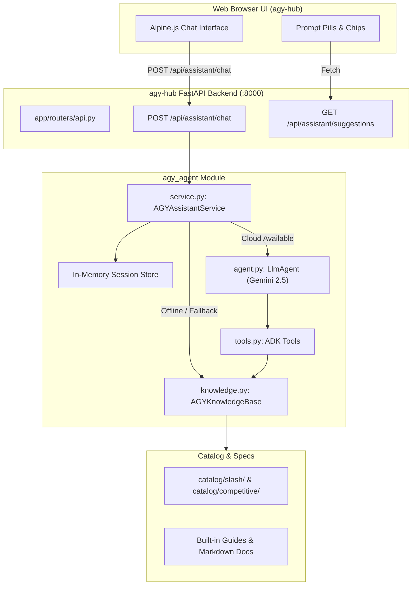

# Technical Specification: Antigravity Hub (agy-hub) Chatbot Agent

**Application / Component Name**: `agy-agent` (AI Assistant Chatbot for `agy-hub`)  
**Specification Author**: @pm (Product Manager Persona)  
**Status**: Pending Review & User Approval  
**Target Completion Date**: 2026-09-30  
**Repository Workspace**: `/Users/laleha/Documents/Projects/anti-gv/agy`  

---

## 1. Executive Summary & Objective

The user requested:
> *"create agent that will act as chatbot for agy-hub , some code is done already , compelet it"*

The goal of this project is to deliver a fully functional, production-ready AI Assistant Agent integrated seamlessly into **Antigravity Academy / Hub (`agy-hub`)**. The agent provides interactive guidance, technical documentation lookup, slash command instructions, competitive feature comparisons (Cursor, Claude Code, Devin, etc.), and configuration template generation directly within the `agy-hub` web interface.

A partial implementation currently exists across `agy-agent/` (the standalone ADK agent prototype) and `agy-hub/` (the web dashboard containing initial backend endpoints and frontend tabs). This specification details the audit of existing assets, identifies missing components, and blueprints the exact implementation required to complete the chatbot integration.

---

## 2. Assessment of Current State ("What is Done" vs "What Needs Completion")

### 2.1 What is Already Done
1. **Catalog & Grounding Data (`catalog/` & `agy-hub/catalog/`)**:
   - Comprehensive Antigravity documentation: slash commands JSON/Markdown (`slash_commands.json`, `plan_vs_goal.md`), competitive parity matrix (`competitive_matrix.json`, `feature_parity_matrix.md`).
2. **Knowledge Engine Prototype (`agy-agent/app/knowledge.py` & `agy-hub/agy_agent/knowledge.py`)**:
   - In-memory indexer for slash commands, competitive matrices, and documentation retrieval.
   - Config generator for `AGENTS.md`, `GEMINI.md`, `SKILL.md`, and `mcp.json`.
3. **ADK Agent Prototype (`agy-agent/app/agent.py`)**:
   - `Agent` declaration using Google ADK with Gemini model and 6 registered tools (`search_agy_catalog`, `get_slash_command_manual`, `compare_agy_feature`, `explain_plan_vs_goal`, `fetch_latest_agy_docs`, `generate_config_template`).
4. **Service Layer Prototype (`service.py`)**:
   - `AGYAssistantService` with hybrid fallback (handles queries offline via rule-based catalog lookups when cloud credentials are absent).
5. **Initial Hub Integration (`agy-hub/app/routers/api.py`, `templates/index.html`, `static/app.js`)**:
   - REST endpoints `/api/assistant/chat` and `/api/assistant/suggestions`.
   - UI Tab 5 ("AI Assistant") in Alpine.js with chat history, suggestion chips, and Markdown rendering.
   - Initial pytest suite in `agy-hub/tests/test_api.py`.

### 2.2 What Needs Completion (Gaps & Deficiencies)
1. **Catalog Path Resolution Robustness**:
   - `knowledge.py` has multiple redundant fallbacks that break if `agy-hub` or `agy-agent` runs in different working directories or inside Docker containers. Must standardize on deterministic resolution: `CATALOG_DIR` env var -> app local `catalog/` -> workspace root `catalog/`.
2. **Codebase Synchronization & Clean Architecture**:
   - Currently, duplicate files exist between `agy-agent/app/` and `agy-hub/agy_agent/`. When updates occur, one can drift from the other.
   - Need unified packaging: Ensure `agy-hub` reliably loads `agy_agent` both in local dev (referencing workspace package) and in production/containerized environments.
3. **Multi-Turn Session Memory in Assistant Service**:
   - Currently, `assistant_service.answer_query(query, session_id)` ignores `session_id` in offline fallback mode and does not preserve multi-turn dialogue context on the backend.
   - Need an in-memory session store in `AGYAssistantService` to retain conversational context per session ID.
4. **Resilient Error Recovery & Hybrid Model Execution**:
   - If Vertex AI or Google GenAI API credentials fail or experience rate limits, the service must gracefully fall back to the catalog retriever without throwing 500 errors to the frontend.
5. **Environment Isolation Compliance (.agents/GEMINI.md)**:
   - Ensure virtual environment `.venv` is cleanly provisioned and verified in both subprojects (`agy-hub` and `agy-agent`).
   - Run `black` code formatter across all modified files.
6. **Automated Test Coverage**:
   - Unit tests for multi-turn sessions, error fallbacks, and catalog path resolution.
   - End-to-end integration test verifying that the chatbot responds accurately across all categories (slash commands, comparisons, config blueprints, doc searches).

---

## 3. User Stories & Acceptance Criteria

### User Stories
- **US-1**: As a developer browsing `agy-hub`, I can open the "AI Assistant" tab and ask questions about Antigravity (e.g., *"/plan vs /goal"*, *"/grill-me syntax"*, *"Compare AGY to Cursor"*) and receive grounded, accurate answers with citations.
- **US-2**: As a user with ongoing dialogue, the assistant remembers the immediate context of our conversation within the active session.
- **US-3**: As a developer setting up a new project, I can prompt the chatbot to *"Generate .agents/AGENTS.md for PM, Coder, and QA"* and receive a valid copy-pasteable configuration template.
- **US-4**: As an operator deploying `agy-hub` via Docker or Cloud Run, the chatbot service initializes reliably without crashing if external cloud credentials are not immediately configured.

### Acceptance Criteria
- [ ] All chat endpoints (`POST /api/assistant/chat`, `GET /api/assistant/suggestions`) respond with HTTP 200 for valid inputs.
- [ ] Multi-turn session context is maintained when `session_id` is supplied.
- [ ] 100% test pass rate across `agy-hub/tests/` and `agy-agent/tests/unit/`.
- [ ] Code formatted with `black` and adheres strictly to Python 3.11+ type hints.
- [ ] No global package installations; execution commands strictly use `source .venv/bin/activate && ...`.

---

## 4. System Architecture


```mermaid
graph TD
    subgraph Browser ["Web Browser UI (agy-hub)"]
        UI[Alpine.js Chat Interface]
        Suggestions[Prompt Pills & Chips]
    end

    subgraph HubBackend ["agy-hub FastAPI Backend (:8000)"]
        APIRouter["app/routers/api.py"]
        ChatEndpoint["POST /api/assistant/chat"]
        SuggEndpoint["GET /api/assistant/suggestions"]
    end

    subgraph AgentCore ["agy_agent Module"]
        Service["service.py: AGYAssistantService"]
        SessionMgr["In-Memory Session Store"]
        Knowledge["knowledge.py: AGYKnowledgeBase"]
        Tools["tools.py: ADK Tools"]
        ADKAgent["agent.py: LlmAgent (Gemini 2.5)"]
    end

    subgraph KnowledgeData ["Catalog & Specs"]
        CatalogFiles["catalog/slash/ & catalog/competitive/"]
        DocGuides["Built-in Guides & Markdown Docs"]
    end

    UI -->|POST /api/assistant/chat| ChatEndpoint
    Suggestions -->|Fetch| SuggEndpoint
    ChatEndpoint --> Service
    Service --> SessionMgr
    Service -->|Cloud Available| ADKAgent
    Service -->|Offline / Fallback| Knowledge
    ADKAgent --> Tools
    Tools --> Knowledge
    Knowledge --> KnowledgeData
```

---

## 5. Component Specifications & Implementation Plan

### Component A: Knowledge Base (`knowledge.py`)
- Standardize catalog lookup:
  ```python
  def resolve_catalog_dir() -> Path:
      # 1. Environment variable
      # 2. Local application catalog (./catalog)
      # 3. Workspace level catalog (../catalog or ../agy-hub/catalog)
  ```
- Enhance semantic keyword matching and ensure zero unhandled exceptions when catalog files are partially loaded.

### Component B: Assistant Service (`service.py`)
- Add `SessionContextManager` tracking user history per `session_id`:
  - Store last `N` messages (user & assistant).
  - Inject recent context into queries.
- Ensure hybrid execution:
  - If `GOOGLE_API_KEY` / `GOOGLE_CLOUD_PROJECT` is set: attempt ADK Runner first.
  - On network error, quota exceeded, or missing keys: cleanly fall back to local knowledge retrieval with `source` attribution.
- Return structured payload matching `AssistantChatResponse`:
  ```json
  {
    "response": "...",
    "source": "Antigravity Master Catalog",
    "tool_used": "get_slash_command_manual",
    "metadata": {}
  }
  ```

### Component C: Hub API Router (`agy-hub/app/routers/api.py`)
- Ensure robust import of `agy_agent.service`:
  - Checks local `agy_agent` package inside `agy-hub` first.
  - Falls back to sibling `agy-agent` package.
- Support `session_id` in `AssistantChatRequest`.
- Return proper HTTP 400 when message is empty or whitespace only.

### Component D: Frontend UI & Client (`index.html` & `static/app.js`)
- Maintain client-side `session_id` (generate a unique session UUID on init).
- Pass `session_id` in all `/api/assistant/chat` requests.
- Render responses with GitHub-flavored markdown, code highlighting, tool usage pill, and source citation.

### Component E: Packaging, Virtual Environments & Quality Assurance
- Ensure `.venv` exists in both `agy-hub` and `agy-agent`.
- Verify full test suite execution with `pytest`.
- Run `black` formatter on all code files.

---

## 6. Execution Plan & Multi-Agent Protocol

1. **Step 1: Requirements Architecture (@pm)**
   - Draft and record this technical specification (`technical_spec.md`).
   - Stop and request explicit user confirmation (`"Approved"`).

2. **Step 2: Full-Stack Generation (@coder)**
   - Upon receipt of user `"Approved"`, implement the complete logic in `agy-agent/app/` and `agy-hub/agy_agent/` and `agy-hub/app/routers/api.py`.
   - Update `knowledge.py` catalog resolution and `service.py` session management.
   - Synchronize code between `agy-agent` and `agy-hub`.
   - Format all files with `black`.

3. **Step 3: Verification & Walkthrough (@qa)**
   - Execute all unit and integration tests via `source .venv/bin/activate && pytest`.
   - Validate edge cases (empty input, missing credentials, offline fallback).
   - Generate full implementation verification walkthrough report.

---

## 7. Approval Gate

**Drafted by**: Product Manager (@pm)  
**Status**: Awaiting User Review  
**Action Required**: Please review this specification and reply with **`Approved`** to proceed with Step 2 (@coder implementation).
